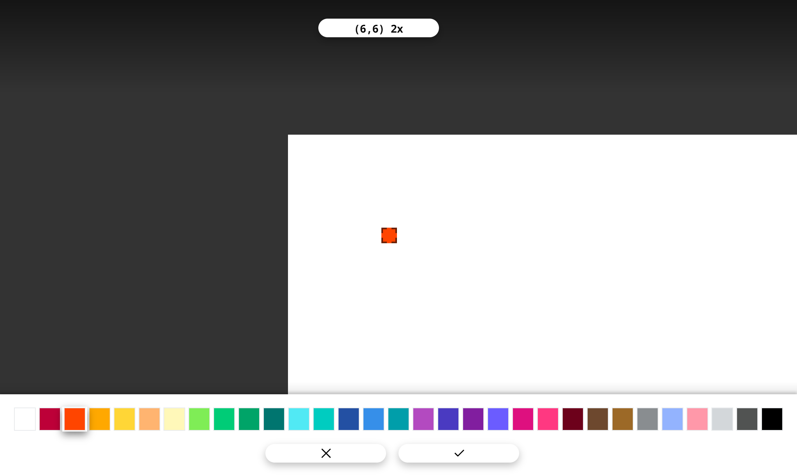
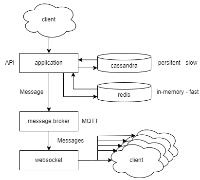

# Reddit r/place clone

This project is a copy of the reddit april fools 2022 event that I've made to try new things.



## Getting Started

Follow these instructions to get a copy of the project up and running on your machine.

### Prerequisites

* [nodejs](https://nodejs.org/)
* [docker](https://www.docker.com/) (optional, I've used docker to make the installing process easy)

### Installing with docker

1. Download/clone the repository
2. Create your ".env" file for the "place-client" folder.
   1. Go to the "place-client" folder and make a new ".env" file.
   2. Copy the content from the ".env.example" file
   3. Change only the ip address
3. OPTIONAL - in the "docker-compose.yml" file of the root folder you can change the port (default 80) for the client.

   * ```yml
     ports:
      9898:80
        ```

    Change "80" with the port that you want for the client.

4. Run the ```docker compose up``` command in the root folder of the repository.
5. Go to ```youripaddress:80``` and you can see the client running.

You can also run every component of the project "alone" and withoud docker. If you want to follow this path you need to create in the api, websocket, client folders an ".env" file and configure it as u want (port, ip address...), you can copy the ".env_example" file that you find in every folder.

### How to restore the board from cassandra

1. Inside the "api" container go to the "dist" folder
2. Run: ```node restore.js``` 

## How it works



To realized the copy of the 2022 april fools event. I've followed the [reddit blog post](https://www.redditinc.com/blog/how-we-built-rplace/) and found countless tips. Before this project I've not used much redis, cassandra or rabbitmq but wanted to try how to fit all of them in a single project.

When a user draw a cell the client call an api. This api call update the cassandra database with user, color, position informations. And the redis in-memory database with only the color information. Then the api also send a new message to a rabbitmq queue.
The client is also connected to a websocket that listen any new rabbitmq queue message. When a new "place"(draw a cell) event comes the websocket server send to all the clients the new update.

## Built With

* [Vue.js](https://vuejs.org/) - The web framework used for the client
* [redis](https://redis.io/) - In-memory database
* [Cassandra](https://cassandra.apache.org/_/index.html) - Persistent database
* [RabbitMQ](https://redis.io/) - Message broker
* [Docker](https://www.docker.com/)

## License

This project is licensed under the GNU AFFERO License - see the [LICENSE](LICENSE) file for details
